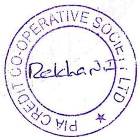
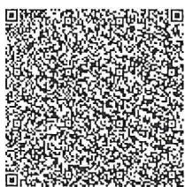
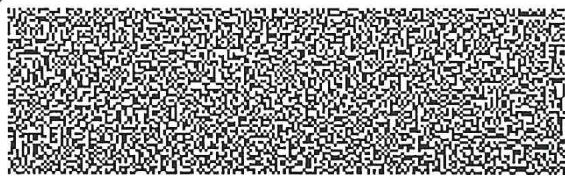

# Government of Karnataka

## e-Stamp

## Certificate No.

Certificate Issued Date

Account Reference

Unique Doc. Reference

Purchased by

Description of Document

Property Description

Consideration Price (Rs.)

First Party

Second Party

Stamp Duty Paid By

Stamp Duty Amount(Rs.)

: IN-KA55931934863743Y  
: 20-Jan-2026 02:02 PM  
: NONACC (FI)/ kacrsfl08/ PEENYA3/ KA-RJ  
: SUBIN-KAKACRSFL0813410786917796Y  
: HEALTHIUM MEDTECH LIMITED  
: Article 5(J) Agreement (in any other cases)  
: TRANSPORTATION SERVICES AGREEMENT  
: 0
    (Zero)  
: HEALTHIUM MEDTECH LIMITED  
: FM INDIA SUPPLY CHAIN PVT LTD  
: HEALTHIUM MEDTECH LIMITED  
: 500
(Five Hundred only)

seal

PIA CREDIT CO-COPERATIVE SOCIETY LTD
Pakharj F

text_image

QR code image containing encoded data, no visible human-readable text

text_image

Scanned image of a QR code with machine-readable data, no readable text or symbols beyond the matrix pattern.

Please write or type below this line

This stamp paper forms an integral part of the Transportation Services Agreement executed by and between Healthium Medtech limited and FM India Supply Chain Pvt. Ltd. executed on 02nd February 2026 and effective from 01st February 2026.

seal

Healthium Medtech Limited
Bangalore

# TRANSPORTATION SERVICES AGREEMENT

This Transportation Services Agreement is entered into on the 02 $^{nd}$ Day of February 2026 (“Execution Date”) and is effective from the 01 $^{st}$ Day of February 2026 (“Effective Date”).

## BY AND BETWEEN

M/s. HEALTHIUM MEDTECH LIMITED (CIN No. U03311KA1992PLC013831), a company incorporated under the Companies Act, 1956 and having its registered place of business at 472/D, 4th Phase, 13th Cross Peenya Industrial Area, Bangalore, Karnataka 560058 IN, India, duly represented by its authorized signatory and Group Chief Operating Officer Mr. Rajnish Damani (hereinafter referred to as the “Customer” or “Healthium” or “Client” or “Company”, which expression shall, wherever it occurs, mean and include its affiliates, successors in office and assigns), of the FIRST PART.

## AND

FM India Supply Chain Pvt. Ltd.\_ (CIN: U74900PN2015PTC178447), a company incorporated under the Companies Act 2013, having its registered office at\_Office Nos. C1501 to C1504, 15th Floor, Amar Business Zone, Sayakar Chowk, Veerbhadra Nagar, Baner, Pune – 411045, duly represented by its Authorized Signatory and Chief Financial Officer Mrs. Bindu Sharma (hereinafter referred to as the “Service Provider”or “Transporter”, which shall, unless repugnant to the context or meaning thereof shall include its associate companies, affiliates, representatives, successors, and permitted assigns) of the SECOND PART.

CUSTOMER and the SERVICE PROVIDER shall jointly be referred to as "Parties" and individually as "Party".

WHEREAS the Customer is engaged in the business of manufacturing, marketing and sale of Surgical and Wound closure products, consumables and minimally invasive products for domestic and international use and is desirous of engaging a Service Provider for pickup, transportation of its goods within India.

AND WHEREAS the Service Provider inter-alia is engaged in the business of Courier/Logistics Services.

AND WHEREAS the Service Provider represents itself as having the requisite expertise, infrastructure and network capability as a logistics service provider as required by the customer.

AND WHEREAS the Customer based on the representations made by the Service Provider, hereby appoints the Service Provider to provide logistics services under this Agreement as detailed hereinafter.

AND WHEREAS the Party sharing the information shall be referred to as the “Disclosing Party” and the Party receiving such information shall be referred to as the “Receiving Party”

NOW THEREFORE IN CONSIDERATION OF THE PROVISIONS AND MUTUAL CONVENANTS CONTAINED HEREIN, IT IS AGREED BY AND BETWEEN THE PARTIES AS FOLLOWS:

seal

Healthium Medtech Limited
Bangalore

## 1.0 COMMENCEMENT OF AGREEMENT (TERM):

This Agreement is effective from 01 $^{st}$ February 2026 (“Effective Date”) for a period of 2 years i.e. till 31 $^{st}$ December 2027 and Service may be renewed/terminated further, upon the mutual written consent of the Parties as per the terms of the Agreement.

## 2.0 SCOPE OF CONTRACT

A. By conducting any type of Contract with the Transporter that involves the Carriage of goods, company agrees that:

(i) The contract is a contract for carriage of goods by road if the carriage of the Consignment actually takes place by road.

(ii) The contract is a contract for carriage of goods by air if the carriage of the Consignment actually takes place by air.

B. The Service Provider shall provide the services as described in Annexure 1 (“Services”) to this Agreement which includes pick up of the Client’s packed goods (“Goods” or “Consignment”) from the location/(s) designated by the Client and delivery of same to the consignee’s (“Consignee”) locations as specified by the Client.

C. Any Consignment not delivered at the destination location due to unavailability of the Consignee or otherwise, if requested to be rebooked by the Client, shall be rebooked by the Service Provider on the rates as mutually agreed by the Parties in writing (outbound rates as per the Annexure 2).

D. If any services, to be provided by the Service Provider to the Client, is not specifically set forth in this Agreement, then both Parties shall capture the exact nature of any such additional services and any additional service charges for providing such services in writing vide an addendum to this Agreement. All such addendums/amendments thereto along with the recitals, and annexures, hereto shall be deemed to be incorporated in this Agreement by reference and shall be considered as an integral part of this Agreement.

## 3.0 TRANSIT TIME:

1. Turn Around Time (TAT) as mentioned under Annexure I between pickup and delivery points shall be as communicated by the Service Provider. The transit times and assurances are subject to change prior to providing reasonable notice to the Customer in writing.

## 4.0 CONSIDERATION:

The Parties hereto agree that the Service Provider shall invoice or charge the Customer for the Services rendered by it as per the tariff structure and rates described in the Annexure 'II', and the Customer shall make payments accordingly, subject to further clarifications included herein under.

## 4.1 TOTAL FREIGHT CHARGES:

Total Freight charges include Base Freight and all other components detailed in the Annexure 'II', but excludes cess, duties and any other taxes as may be levied by the Authorities from time to time and payable by the Service Provider with pass through to the Customer.

## 4.2 INVOICE WEIGHT:

seal

Healthium Medtech Limited
Bangalore

Weight of the Shipment shall be measured as per the Volumetric Calculation of multiple packing shipper cartons with the different dimensions- which is captured in the Annexure 'II'.

## 4.3 FUEL SURGE CHARGE:

Fuel Surge Charge (FSC) is mutually agreed by both the parties which is part of the commercials mentioned in the Annexure II.

## 4.4 RISK CHARGES:

Healthium is under obligation to insure its shipments at its own cost. The Service Provider thereby agrees to directly compensate Healthium for any loss, theft and/or damage of Goods while in transit, up to Rs. 10,000/- (Indian Rupees Ten Thousand only) above which the Service Provider shall support the customer in providing the necessary documents as a part of COF (Certificate of Facts) which will enable Healthium to claim the loss amount from its insurance company provided there are remarks on POD (Proof of Delivery) specifying the damage /shortage in the Consignment or the Consignment has been marked “Lost” by the service provider. Any ROV can be used while the Goods are in transit, on mutual agreement between the Parties.

## 4.5 REMOTE LOCATION-ODA/ESS:

Both the parties mutually agree to the TAT defined in Annexure- I for ODA locations. The Service Provider shall share the list of Serviceable Pin codes and the pin codes falling under ODA Category along with their TAT. If the Service Provider fails to deliver at ODA locations as per the TAT, because of the service provider's internal issues there shall be a penalty of $5\%$ on such dockets which are delivered 5 days beyond the agreed TAT.

However, Customer understands that there can be unforeseen circumstances beyond the of the Service Provider control causing delivery delay, which shall be consider with no penalty. However, the Service Provider shall take all such reasonable efforts to deliver at ODA locations despite the presence of an unforeseen circumstance impeding then to deliver the Goods. In the event that the Service Provider is not able to circumvent the unforeseen situation despite reasonable efforts on its part, then no penalty shall be incurred by them. However, the Service Provider must intimate the Company of the unforeseen circumstance and the steps they took to circumvent the said situation, within 10 days from the date of the unforeseen circumstance, in writing to the Customer.

## 4.6 TAXES, DUTIES AND OTHER CHARGES:

a) The Freight charges quoted in Annexure -II are exclusive of all taxes.

b) Healthium shall submit all the relevant documents/papers along with the shipment including but not limited to documentation for Octroi clearance, wherever applicable. Such documents provided by the Customer shall certify that all statements and information relating to shipments under this contract are true and correct.

c) Healthium agrees to pay GST, CESS and any other taxes / levies, etc., as may be applicable on the freight and other applicable charges from time to time. Service Provider is not responsible for any default/irregularity committed by the Healthium in paying the same. The GST details of the Customer are provided herewith as Annexure-III.

d) Service Provider in its sole discretion may initially pay any GST/Cess/taxes/levies as may be levied by the authorities on behalf of the Customer / receiver / consignee and the same shall be reimbursed at the time of delivery of the shipment. In the event the Company refuses or fails to pay the same, the Customer shall be responsible and liable to reimburse the same within seven (7) days from the date of demand by Service Provider. Service Provider shall not extend any credit limit for levies/cess/other such statutory charges.

seal

Healthium Medtech Limited
Bangalore

e) The Customer agrees and undertakes to submit all the relevant documents / papers / E-way Bill Copy / E-way Bill electronic reference number / Goods Forwarding Note and / or other details as stipulated under the GST Code applicable under different laws/rules/procedures from time to time, including but not limited to documentation for tax clearance, along with handover of the shipment at the time of booking. The Customer shall be solely held liable in case any shipment is seized or held by any authority due to non-availability of required documents/papers. However, Service Provider agrees to provide duplicate receipts/service providers invoice in case the originals are misplaced in transit, and further the Customer / receiver undertakes to pay for the same including any other statutory charges on the strength of the above documents without any demur. The Service Provider will under no circumstances, be liable for damages or loss or liability caused due to confiscation of the shipment or any part thereof by any government, semi government authority etc.

f) The Customer hereby agrees and undertakes to declare the accurate description and details of each shipment in the relevant E-way Bill without fail. The Customer further agrees and confirms that the Service Provider shall not be liable for any dis-allowance or issues or claims that may arise due to inaccurate and / or incorrect details mentioned in the E-Way Bill, and the Customer shall be solely responsible for seizure or detention of any shipment by any authority due to such inaccurate and / or incorrect details mentioned in the E-way Bill or otherwise.

g) The Customer hereby declares that the details provided with respect to GSTN are true and accurate and as such, it agrees and confirms that Service Provider shall not be liable for any disallowance or issues that may arise due to inaccurate and / or incorrect GSTN number mentioned on Service Provider's Invoice / Credit Note / Debit Note, as the case may be. In the event the Service Provider inadvertently mentions an incorrect GSTN on its invoices, the Customer shall forthwith bring such fact to the Notice of the Service Provider and obtain revised invoices.

h) The Customer shall be entitled to deduct tax deducted at source (TDS) on the amounts payable / paid towards logistics services in accordance with the provisions of the Income Tax Act, 1961 as applicable. The Customer shall furnish the TDS certificates on a quarterly basis to the Service Provider. The Customer agrees to refund the TDS amount if TDS certificates have not been provided within the time limit prescribed under the Income Tax Act / Rules.

## 5.0 INVOICING & PAYMENT TERMS:

a) In compliance with the provisions of the GST Code, the Parties hereby agree and confirm that Service Provider's booking unit location shall raise invoice on Customer's principal place of business location and accordingly mention the GSTIN as provided by the Customer in Annexure-IV i.e., state of origin location/ Bill to location. In case the Customer confirms to raise the invoice on ISD registered office, then it shall be the responsibility of the Customer to ensure that the input tax credit is appropriately distributed as per the provisions of the GST Act. Non-adherence to the above shall entail the Customer to indemnify the Service Provider against any statutory liability that may arise to the Service Provider due to such default on part of the Customer in distributing the input tax credit correctly as ISD.

seal

Healthiam Medtech Limited
Bangalore

a. Service Provider shall raise and submit the invoice (e-invoice) on a monthly basis, as specified in Annexure II, for the Services rendered by it against dockets delivered within each period. As agreed by the Parties, the invoice cycle will be on a fortnightly basis. Invoice will be raised and sent in electronic format, on the Client's registered email ID registered with the Service Provider, on or before $10^{\text{th}}$ day of every subsequent calendar month for all the Services provided in previous calendar month. The Customer agrees to pay all invoices within the 30 days from the receipt of the invoices, as specified in Annexure II, All payments shall be made through Digital Modes or through an RTGS/NEFT/IMPS transfer to the designated bank account in favor of FM INDIA SUPPLY CHAIN PVT LTD\_Details of the designated bank account are as included in the attached Annexure IV.

b) The Parties hereby agree and confirm that Service Provider shall not be liable for any penalty or liquidated damages or deductions from the freight or otherwise. While the Service Provider undertakes to address all issues to the entire satisfaction.  
c) Further, the Parties hereby agree and confirm that any correction and / or deduction in the Invoice/s shall always be carried out by issuing proper debit note / credit note, as the case may be, without fail. Further, the Customer shall not request for or force issuance of credit notes after the expiry of the credit days in any circumstances.  
d) Any shipment returned/redirected to Origin /some other destination shall be sent on a fresh Docket / Consignment Note / E-Way Bill / Airway bill and the applicable freight charges shall be payable by the Customer.  
e) The Customer shall intimate any discrepancies or inconsistencies in any invoice received from the Service Provider within 7 days of the receipt of such invoice, failing which such invoice shall be deemed accepted and undisputed by the Client and all amounts under such invoices shall become payable within the agreed timelines. The Parties shall settle any disputes under the invoices amicably upon mutual discussion and if Parties fail to settle the dispute in the aforesaid manner, the dispute shall be settled between the Parties in accordance with Clause 24.0 and 25.0 of this Agreement.  
f) Furthermore, parties agree that non-adherence or deviation from payment terms by the Customer shall result into a breach of Customer's representations and warranties under this agreement. On occurrence of such deviation/non-adherence, Service Provider shall have the right to terminate the agreement by serving a written notice to Customer.  
g) The Parties hereby agree and confirm that acknowledgment of submitted invoices and release of payments shall not be linked to provision of MIS report or any additional information / documents by Service Provider to the Customer.  
h) The Service Provider shall raise and submit the invoice on a monthly basis for the services rendered by it, in the previous month. Payment shall be made to the service provider within 30 days by Company from the date of receipt of bill submission with Original Proof of Delivery (POD), failing which the Service Provider shall reserve the right to charge interest @2% per month beyond the due date.  
i) Notwithstanding anything contrary contained elsewhere in the Agreement, the Service Provider may suspend the Services immediately if the Customer defaults in making any payment to the undisputed invoices as per the agreed terms under this Agreement.  
j) The Parties hereby agree that e-POD or scanned copy of the POD duly attested by the consignee, shall be accepted by the Customer as final confirmation of delivery of the docket cargo to the consignee. The Service Provider at its sole discretion may provide original POD's on the special

request of Customer for exceptional cases, subject to payment of necessary charges as per the Service Provider's tariff, as may be applicable from time to time.

## 7.0 CLAIMS:

(a) The Customer hereby agrees not to deduct/adjust/set off any claim, from the outstanding amount payable towards freight to Service Provider, and further hereby agrees to follow the process herein below as specified by the Service Provider for settlement of claims.  
(b) No claim shall be entertained by Service Provider for any loss, shortage, damage, non-delivery, breakage, leakage, pilferage, etc., for the shipments/dockets unless a written claim is lodged within three (3) days from the date of delivery or within twenty-one (21) days from the date of booking, whichever is earlier. Any claim is subject to continued payment of HRR/ROV at the time of booking and remarks on the Proof of Delivery (POD). Remarks / endorsements on Invoice are not eligible for claim process.  
(c) The Parties hereby agree and confirm that the obligation of Service Provider to settle the claim shall arise subject to Customer furnishing all relevant documents as specified in the Service Provider's Claim SOP, and the Service Provider assures claim processing within fifteen (15) days from the date of the customer's claim intimation with completed documentation.  
(d) For Customer's on Owner's Risk, in case of validated loss and/or damages in docket shipments wherein the corresponding Customer Invoice Value exceeds INR 10,000/- (Rupees Ten Thousand only), the Service Provider shall extend all support to the Customer by way of issuing the Certificate of Facts or Observation Note (OBN) within fifteen (15) days so that the Customer is able to lodge and process its insurance claim through its own third party insurance arrangement. In case of validated loss and/or damages in Docket shipments wherein the corresponding Customer Invoice Value is under INR 10,000/- (Rupees Ten Thousand only), the Service Provider shall compensate the customer through issuance of a Credit Note.

## 8.0 TIME GUARANTEED PRODUCTS

If the service provider fail to deliver time guaranteed products (that service provider may offer and that Company ordered) within the time specified and if the service provider's failure was not caused by any events set out in agreement and if the Company notifies service provider of its claim in compliance with clause 7, service provider will charge Company for the actual delivery service provided rather than charging the price service provider quoted for the service Company had asked for within the same product category as the service Company ordered.

## 9.0 LIMITED LIABILITY:

(a) Carriage of shipments by the Service Provider will be prone to several constraints by the external agencies, which are beyond its reasonable control. Service Provider shall not, under any circumstances, be liable for any consequential, incidental or special damages, direct or indirect loss, claims, expenses or delay in pick up, transportation or delivery of any shipment, regardless of the causes of such delays, of whatsoever nature and howsoever arising.  
(b) The Service Provider shall not be liable in any manner, whatsoever, to the Customer/consignee or any third party, if the consignee/receiver has accepted the shipment, without any demur, by signing the Proof of Delivery (POD). The responsibility of Service Provider ceases immediately once the shipment(s) is/are delivered.  
(c) No liability will be assumed by the Service Provider for any errors / omissions of any

information / data that is imparted by the Customer in respect of the shipment/s traveling under the Docket/ Consignment Note / E-Way Bill / Airway bill.

Notwithstanding anything to the contrary contained elsewhere in this Agreement, the total cumulative liability of the Service Provider under this Agreement, including any indemnities provided, shall be limited as under:

1. Notwithstanding anything to the contrary contained elsewhere in this Agreement, the total cumulative liability of the Service Provider under this Agreement, including any indemnities provided, shall be limited as under:  
i. One (01) month's Service Charges paid/payable by the Client immediately preceding the occurrence of the claim; and  
ii. In respect of any damage or loss of the Goods, while the Goods are in the custody of the Service Provider, solely due to the proven gross negligence or wilful acts of the Service Provider, the total cumulative liability of the Service Provider during the Term of this Agreement shall not exceed the landing cost of the lost/damaged Goods.

1. In respect of the Consignments marked as lost/damaged where the invoice value of the Consignment(s) is less than or equal to INR 10,000/- (Indian National Rupees ten thousand Only), the Service Provider will issue a credit note amounting to the aforesaid value or for an amount up to the invoice value of the Consignments involved, whichever is lesser.  
2. In respect of the Consignments marked as lost/damaged where the invoice value of the Consignment(s) is more than INR 10,000/- (Indian National Rupees ten thousand Only), the Service Provider will only issue a COF to enable the Client to claim insurance.  
3. In respect of the Consignments marked as lost/damaged where the value of the Consignment(s) is not mentioned in the invoice shared with the Service Provider, the maximum liability of the Service Provider shall be INR 10,000/- (Indian National Rupees ten thousand only) and the Service Provider will issue a credit note amounting to the aforesaid value.

a. The Service Provider's liability and responsibility with respect to such lost or damaged Consignment shall end upon payment of the aforesaid amounts for such Consignment.

b. A Consignment shall be considered to be “Lost” when the Service Provider is unable to handover the Consignment to the Client/its customer to the Service Provider, including but not limited to scenarios where the Consignment are found untraceable, stolen, seized, hijacked in any manner while under the custody of the Service Provider, other than when the Services are delayed/the Consignment is lost due to an Event of Force Majeure (as defined under Clause 22 hereunder), or due to acts of competent authorities in discharge of their official duties.

c. In the event any Consignment is unclaimed/rejected by the Consignee such Consignments shall be returned to the Client. In case any pharmaceutical Goods, healthcare Goods, drugs and/or medical devices is in the possession of the Service Provider beyond the stipulated 60 (Sixty) days from the date of handover by the Client or damaged while in the possession of the Service Provider, such Goods will be returned to the Client, and the Client shall be obligated to dispose off/liquidate the same in compliance with the applicable laws.

## 10.0 OBLIGATIONS OF THE CUSTOMER:

a) It is expressly understood and agreed by and between the Parties that all shipments entrusted by the Customer and booked by the Service Provider shall be on “SAID TO CONTAIN BASIS” i.e. Service Provider shall be under no obligation to verify the description and physical contents of the shipment declared by the Customer on the Docket/ Consignment Note / E-Way Bill / Airway bill; and as such, the Customer shall undertake and ensure to make correct and factual declaration on the Docket/Consignment Note / E-Way Bill / Airway bill. The Service Provider shall not be liable for the product(s) received from the Client and should not be held responsible for any issues including any product mismatch, fake product, and incomplete product, whatsoever in nature.

b) The Customer shall not book, hand over or allow to be handed over any shipment consisting of goods which are prohibited, restricted, hazardous or dangerous, illegal, stolen, infringing of any third-party rights, in breach of any tax laws, hazardous in nature, harmful chemicals, inflammables, currency notes, bullion, letters, financial and/or security instruments and/or any articles/commodities which are not permissible for carriage under the applicable laws.

c) The Service Provider shall not be liable for the delivery of any such Goods or Consignments. The liability for any error/mismatch in the declaration on the docket of the Consignments and the actual Consignment handed over to the Service Provider would be solely borne by the Client.

d) Subject to Clause 10(b)\_mentioned hereinabove, in the event the Client hands over any banned or restricted Goods to the Service Provider, the Service Provider shall not be liable for any loss, damage, or misappropriation of such Goods and/or for any actions taken by any authorities regarding such Consignments which are banned or restricted in nature.

e) Customer shall not book / hand over any hazardous or dangerous shipment as specified in the "IATA DGR Shipment Regulations Handbook Book", ICÀO (international civil aviation organization) or any governmental, semi-Governmental, executive, legislative or judicial authority department authority, instrumentality, commission, board or statutory corporation of or any corporation or other entity (including a trust), owned or controlled directly or indirectly by, any of the forgoing or any similar body including without limitation, any stock exchange or any self-regulatory organization established under any law or regulation, from time to time.

f) Further the Customer agrees and undertakes to not book / hand over any shipment which is not permitted and / or is restricted by any law / rule from time to time.

g) Also, the Customer agrees and undertakes to not book/hand over any shipment or any items notified by Service Provider to be restricted and/or banned and/or dangerous and/or prohibited from time to time, including but not limited to dangerous or hazardous goods or animals, bullion, currency, bearer form negotiable instruments, precious metals and stones, firearms or ammunition or parts thereof, human remains, pornography and drugs or narcotic substances, etc.

h) The Customer hereby agrees to declare and confirm the weight of the shipments as mentioned in the Dockets at the time of booking only. However, Customers who have bookings at multiple consignor locations linked to the Customer, shall get the weight details of shipments as specified in the Dockets/Airway bill from their own authorized employee at respective location/s or shall rely upon the daily booking file sent by Service Provider on daily T+1 basis, and any variance in weight shall be notified to Service Provider on the same T+1 day, before the cut off time. The Customer shall not deduct / adjust / set off any amount from the invoices, payable to Service Provider on account of Weight Variance.

i) The Customer shall ensure that the packaging of the shipment is adequate to carry the shipment, carriage worthy, so as to withstand the normal rigors, jerks and jolts of transportation hazards. Service Provider reserves its right but not an obligation to reject any shipment, if the packing is not transit worthy. The Client shall ensure that the invoices containing the required details (as required under the applicable laws) are enclosed along with the Consignments prior to being handed over to the Service Provider. Notwithstanding anything contained herein, the Service Provider shall not be liable and/or responsible for any loss and/or damage of the Consignment, if the Client is not in strict compliance with the requirements stipulated in this clause.

seal

Healthium Medtech Limited
Bangalore

j) The Customer certifies that all the statements, details and information relating to shipments provided by the Customer under this Agreement are true and correct. The Service Provider shall not be responsible or liable for the improper documentation provided and incorrect information furnished by Customer.  
k) If the Customer/ Consignee refuses to accept the delivery or to pay on delivery wherever applicable, or the shipment is deemed to be unacceptable or if the Customer/ Consignee cannot be reasonably identified or located, Service Provider will rebook the same to origin or to any other address specified by the consignor as specified under Clause 5(e) above.  
1) The Customer shall be liable and solely responsible for any manufacturing defects / disposal of damaged / defective and expired goods and will ensure timely disposal of such products as per statutory guidelines.  
m) The Customer hereby undertakes and represents that it is in compliance with all the applicable laws including but not limited to circulars, guidelines, etc., and warrants the Service Provider that it shall comply with all the applicable laws, circulars, guidelines, etc., as may be notified from time to time including but not limited to Legal Metrology Act, 2009 and the Legal Metrology (Packaged Commodities) Rules, 2011, Drugs & Cosmetics Act, 1940 and Rules thereunder (Drugs Rules 1945, and Medical Devices Rules 2017), Narcotic Drugs and Psychotropic Substances Act, 1985 and rules thereunder, Drugs (Prices Control) Order (DPCO), Drugs and Magic Remedies (Objectionable Advertisement) Act, 1954. The Poison Act 1919 and Rules thereunder, Food Safety and Standards Act (FSSA), 2006, Bureau of India Standards Act 1986, Electronics and Information Technology Goods (Requirements for Compulsory Registration) Order 2012, ISI Mark Scheme, Energy Conservation Act 2001, the Bureau of Energy Efficiency (established in March 2002) and BIS CRS/ BIS- ISI BEE Product Safety and Standards Regulations and it shall solely be responsible for any violation of any statute or regulation or circular or guideline etc., as may be issued by any authority either for movement or otherwise.  
n) The Customer hereby agrees and undertakes that any employee, agent, representative, contractor employed directly by the Service Provider or through any contractor working for Service Provider or any of its group companies should not be hired by the Customer or its group companies within twelve (12) months of his/her date of cessation of any relation with Service Provider or any of its group / associate companies.  
o) The Customer hereby agree and undertakes that it will at all times conduct its business and otherwise comply and ensure that every representative, employee, officer, The Delivery Personnel and the director will in relation to the conduct of its business (i) in all respects comply with the Service Provider's code of conduct; and (ii) does not undertake or cause to undertake any corrupt act or agree to assist any person to retain the benefits of or profits from a crime or any corrupt act.  
p) In the event, if any loss or damage is caused to the assets or property of the Service Provider, and/or any injury/death is caused to the Service Provider's personnel due to any inherent vice/flaw or manufacturing defect in the products/Consignments handed over by the Client, the Client shall conduct a Root Cause Analysis process ("RCA Process"), identify the cause of the aforesaid loss/damage and provide an action plan to the Service Provider to prevent similar events in future.  
q) The Customer or any of its representative in relation to the Customer affairs, will ensure that neither the Customer nor any of its representative acting for or on its behalf, directly or indirectly:

(i) makes or authorizes the making of any contribution, gift, bribe, influence payment, kickback, or any other fraudulent payment in any form, whether in money, property, or services, or anything of value to any public official or otherwise:

(ii) To obtain favourable treatment in securing or retaining the business of Service Provider or directing any business to or by Service Provider or

(iii) To pay for favourable treatment for business secured by the Customer or to obtain special concessions or for special concessions already obtained, in each case which would have been in violation of any applicable law;

(iv) Commit any act which will violate any applicable anti-corruption laws.

Any instances of violation of this Clause will be viewed in a serious manner and Service Provider reserves the right to take all appropriate actions or remedies as may be required under such circumstances.

## 11.0 INDEMNITY:

a) Against freight and other charges including but not limited to the GST, other taxes and levies levied on the shipment in the event of non-payment of the freight and all other charges, payable by the Customer / receiver / consignee.  
b) Against all claims, losses, charges and expenses incurred by Customer/ Service Provider due to any banned, restricted, dangerous or hazardous items entering into its network due to any omission or commission of the Customer.  
c) In the event that the Customer does any act, deed or thing or fails to do the same, which results in any loss, damage, harm or injury to Service Provider, the Customer agrees to indemnify and hold Service Provider safe and harmless from and against all costs, losses, claims, actions or damage suffered or incurred including any legal costs.  
d) The Service Provider shall be liable only for loss or damage resulting from its own proven gross negligence, wilful misconduct. Except in such cases, the Customer assumes full responsibility and agrees to indemnify and hold the Service Provider harmless from and against any claims, liabilities, costs, or damages arising from the execution of this Agreement, including reasonable legal expenses.  
e) In case of perishable shipment handed by Client, Service Provider shall have the right to dispose of or sell the shipment immediately and without notice and as such, the Customer shall keep Service Provider indemnified against all claims, charges and expenses incurred by Service Provider due to such perishable shipment entering into the network of Service Provider.

## 12.0 ANTI-BRIBERY & ANTI MONEY LAUNDERING POLICY

a. Parties will comply with all the applicable anti-bribery and corruption laws, including the U.S. Foreign Corrupt Practices Act, UK Bribery Act, 2010 and Prevention of Corruption Act India, 1988 and other similar applicable legislation in the jurisdictions where it operates. No Party or its employees, directors, or agents shall offer, promise, provide, or authorize the provision of any money, property or other thing of value, directly or indirectly, to any person, entity or foreign official to influence official action or to secure an improper advantage.  
b. No Government Interaction: Each Party agrees that no Party nor any of its employees, agents and representatives, and any persons associated with such Party are authorized to

engage or interact with any government entity or official for or on behalf of the other Party, directly or indirectly, in any transaction or business activity for any purpose, including but not limited to obtaining a permit, license or other types of authorization, whether at a local, regional, or national level. In the event that any form of interaction with a government entity or government official is required in relation to a Party's engagement, directly and/or indirectly, with the other Party, such Party shall obtain prior written authorization from other Party before proceeding with the engagement or interaction.

c. The Parties will fully comply with all applicable laws and regulations including but not limited to anti-money laundering (including knowing your customer and customer due-diligence) and applicable sanctions (economic and trade) rules and regulations. Neither Party will engage in a transaction pursuant to this Agreement that will cause the other Party to violate such laws and regulations applicable to both Parties. To the best of its knowledge, the Client agrees that the Consignments that it requests the Service Provider to deliver under this Agreement, are not grown, produced, manufactured, extracted, processed in, sourced from, or transported through any of the following jurisdictions: Belarus, Cuba, Iran, North Korea, Russia, Syria, and the following regions of Ukraine: Luhansk People's Republic, Donetsk People's Republic, and Crimea. Any change in the list of countries mentioned herein shall be notified to the Client in writing. The Client shall not request, and the Service Provider shall not deliver any products to the embassies/consulates in India of the following jurisdictions: Cuba, Iran, North Korea, Syria, and Ukraine.

## 13.0 INTELLECTUAL PROPERTY RIGHTS

For the purposes of this Agreement, the term “Intellectual Property” or “IP” shall include, without limitation, any inventions, technological innovations, discoveries, designs, formulas, know-how, processes, business methods, patents, trademarks, service marks, copyrights, computer software, ideas, creations, writings, lectures, illustrations, photographs, motion pictures, scientific and mathematical models, improvements to all such property, and all recorded material defining, describing, or illustrating all such property, whether in hard copy or electronic form.

All rights in the Intellectual Property (“IPR”) existing prior to the signing of this Agreement, will belong to the Party that owned such rights immediately prior to the signing. Neither Party shall gain, by virtue of this Agreement, any rights of ownership on the Intellectual Property owned by the other Party.

Both Parties hereby agree that it will not infringe any Intellectual Property of any third party while performing its obligations under this Agreement.

Neither Party shall not use the name or Intellectual Property of the other Party in its advertising or other publications or in any other manner without the prior written consent of the other Party

## 14.0 FALSIFICATION

This refers to any regulatory documents submitted by the disclosing party with the receiving party for meeting any objectives pertaining to this Agreement. The receiving party represents and assures that any such regulatory documents submitted by the disclosing party with the receiving party for any business purpose will not be tampered / falsified under any circumstances. In the event of such an incident, the business arrangement between the Parties shall stand terminated immediately and the disclosing party shall take the suitable recourse in law for which the receiving partyr alone shall be responsible for the consequences thereof. The above stands applicable for all the Employees, Agents, and Associates etc engaged by the parties with regard to the above business purpose.

## 15.0 GENERAL LIEN:

a) The Service Provider shall have the right to exercise a General Lien over all the shipments of the Customer for non-payment of any dues including levies imposed by any authorities. However, upon request of the Customer, the Service Provider may store the shipments for limited period, as may be mutually agreed between the Parties, at the sole risk of the Customer, subject to payment of demurrage / warehousing charges by the Customer.  
b) In case, the Customer / receiver fails to pay the dues within the stipulated time as mentioned elsewhere in this Agreement, the Service Provider further reserves its right to sell the shipment by public auction, tender, private agreement or otherwise or even destroy the shipment as required under any laws applicable from time to time, without prejudice to its other legal remedies to recover its dues.  
c) The Customer agrees that Service Provider shall not be liable to the Customer or any other person for any loss or damage caused to the shipment or any part thereof, or any diminution in the value of the shipment or any part thereof, by Service Provider in exercising its right of lien hereof.

## 16.0 APPLICABILITY:

The Customer / shipper / beneficiary hereby agrees, confirms, and acknowledge that they are fully aware of the terms and conditions applicable to all shipments that are entrusted to Service Provider, and that all or any such transaction of the shipment shall always be subject to the special terms and conditions hereof, in addition to the terms and conditions as may be updated from time to time.

## 17.0 AMENDMENTS:

Any amendments to the terms and conditions hereof shall be mutually agreed and reduced the same into writing, duly signed by the authorized signatories of both Parties and the same shall be effective after seven (7) days from the date of signing of such amendments.

## 18.0 TERMINATION:

Either Party may terminate this Agreement for convenience by giving one (1) month prior written notice to the other Party, without assigning reason The notice must be sent to the above specified address by registered post with Acknowledgment Due / Speed Post / Email Address only, addressed to the authorized person. However, it is made abundantly clear that the Customer shall forthwith settle all dues pending as on date of termination along with the interest thereon, payable to Service Provider, on receipt of written notice of termination by Service Provider.

Either Party may terminate this Agreement immediately upon written notice to the other Party if:

1. The other Party commits a Material Breach of any terms of the Agreement and fails to cure such breach to the non-breaching Party's reasonable satisfaction within Thirty (30) days after receipt of written notice from the non-breaching Party. For the purposes of this Agreement "Material Breach" shall include but not be limited to a default in payment of Service Charges, breach of confidentiality, and/or breach of applicable laws; or

2. The other Party becomes insolvent or bankrupt, assigns all or a substantial part of its business or assets for the benefit of its creditors, permits the appointment of a receiver for its business or assets, becomes subject to any legal proceeding relating to insolvency (unless the relevant Party is able to get the proceedings withdrawn/ obtain a suitable order to establish its solvency to avoid any adverse action affecting the Agreement within a mutually agreed timeline from the date of initiation of such proceedings) or the protection of its creditors' rights or otherwise ceases to conduct business in the normal course; or

3. Change of any governing law which may adversely impact the rendering and/or availing of Services materially by a Party.

## 19.0 COMPLIANCE

The Service Provider agrees and undertakes to ensure that all consents, registrations, licenses, and approvals necessary for performing and fulfilling its obligations as provided in this Agreement have been obtained and are valid at all times during the Term of this Agreement. In the event of any change in the status/ validity thereof, the Service Provider shall forthwith notify the Customer in this regard. Further, the Service Provider agrees to comply with all applicable laws, rules and regulations within and outside the Territory for the purposes of this Agreement.

The Service Provider agrees and undertakes that the execution and delivery of, or the performance of its obligations under the Agreement do not violate or conflict with any applicable law, rule, regulation or any agreement, contract, promise, covenant, undertaking, representation or warranty, applicable to or made by it.

## 20.0 SEVERABILITY:

If any one or more provisions of this Agreement shall be invalid, illegal or unenforceable in any respect, the validity, legality and enforceability of the remaining provisions contained herein shall not in any way be affected or impaired thereby.

## 21.0 WAIVER

No waiver of any provision or of any breach of this Agreement shall constitute a waiver of any other provisions or any other or further breach, and no such waiver shall be effective unless made in writing and signed by an authorized representative of the party to be charged with such a waiver. Nor shall a one-time waiver of a single provision constitute a permanent waiver of that party's rights under said provision.

## 22.0 FORCE MAJEURE:

If the whole or any apart of the performance of their respective obligations under this agreement by the parties is prevented or delayed by causes, circumstances or events beyond the control of the parties, including delays due to fire, strikes, earthquake, acts of God, War, insurrection, typhoon, flood, torrential rains, heavy winds, storms, plagues, pandemics, other epidemics, or other acts of nature, public commotion, lockdown, terrorist acts, threatened terrorists acts, explosion, breakdown, acts of civil or military authority including, riots, etc. which makes fulfilment of the obligations pursuant to this Agreement impossible, and this situation is deemed to be force majeure under the normal laws in India (not due to any act, neglect or default of the either party), then such party shall be excused from such performance to the extent of such prevention, restriction or interference, provided that such party shall give prompt notice to the other party within a period of seven (7) days from the date of the Force Majeure occurrence and provide a description to the other party of such Force Majeure occurrence in such notice, including a description, in reasonable specificity, of the cause of the Force Majeure; and provided further that such party shall use reasonable efforts to avoid or remove such cause of non-performance and shall perform its duty hereunder whenever such causes are removed.

## 23.0 CONFIDENTIALITY:

seal

Healthium Medtech Limited
Bangalore

“Confidential Information” means all oral, written or electronic information or data, and any accompanying support material and documentation, disclosed directly or indirectly by the Service Provider to the Customer. Subject to the terms and conditions of this Agreement, Customer hereby agrees that during the term of this Agreement and for a period of one (1) year thereafter: (i) Customer shall not publicly divulge, disseminate, publish or otherwise disclose any Confidential Information pertaining to the Service Provider without the Service Provider’s prior written consent, which consent shall not be unreasonably withheld; and (ii) Customer shall not use any such Confidential Information for any other purposes other than purpose agreed herein between the Parties. Disclosing Party will, therefore, be entitled to obtain timely injunctive relief to protect its rights under this Agreement in addition to any and all remedies available at law or in equity.

The Parties shall ensure to adhere to all the provisions of Digital Personal Data Protection Act, 2023 (hereinafter referred to as “DPDP Act”) pertaining to all the Personal data shared by Parties to each other in relation to business activities under this agreement. Any violation of any provisions of DPTP Act by either Party shall render responsible/ accountable for the same and the defaulting/ breaching Party shall be solely responsible for the acts/ omission done by its staffs/ employees or agents. Provided, that any clause contrary to the said act shall be treated as null and void, hence inapplicable.

Notwithstanding anything to the contrary contained in the Agreement, the Parties shall comply with the applicable data protection laws of India governing the protection and processing of any personally identified or identifiable information such as name, age, gender, email address, postal address, telephone number, government identification number, financial information, health information, biometric information, behavioural information or geolocation information, in any form that can be linked to specific individual (“Personal Data”).

The Service Provider shall process such information as a data processor in accordance with the specific instructions of the Client as agreed upon by the Parties in writing prior to the receipt of such information. The Client warrants that any Personal Data disclosed to the Service Provider under this Agreement was collected lawfully, the Client has required consent to disclose it to the Service Provider, and there is no restriction legal or otherwise on the Client from providing such information to the Service Provider or any processing by the Service Provider under this Agreement.

If the Client is located in a non-India jurisdiction, for example in the European Economic Area ("EEA") / European Union ("EU") / US, the Client agrees that the Client has the required consent for onward disclosure or transfer of such data/information, including Personal Data, to India, a jurisdiction that may not provide an equivalent level of data protection to the laws in the Client's home country, however, the Service Provider has implemented and maintains reasonable security practices and procedures for protection of data it processes.

## 24.0 GOVERNING LAW AND JURISDICTION:

This Agreement shall be construed in accordance with the laws of India and shall be subject to the exclusive jurisdiction of Courts at Bangalore in the state Karnataka, India.

## 25.0 ARBITRATION:

In case any dispute or difference arises between the parties during the term of this Agreement or after its termination or earlier termination, as to its meaning and construction or to any other matter, on things arising directly or indirectly under this Agreement, in such an event the same shall be referred to a sole Arbitrator to be appointed by the Service Provider, by fast track procedure governed under the provisions of Arbitration & Conciliation Act, 1996 and Arbitration & Conciliation (Amendment) Act, 2015 or any statutory amendment/s thereof. The Seat/ venue of such arbitration shall be at Bangalore in the state of Karnataka, India and shall be conducted in English Language. The award of the Arbitrator shall be final and binding on the parties. The cost of arbitral proceedings and enforcement of award / interim relief shall be borne by the Customer.

## 26.0 ASSIGNMENT

This Agreement cannot be assigned, or transferred, whether by operation of law or otherwise, by either Party without the written consent of the other Party. At any time during the Term of the Agreement, the Service Provider shall be entitled to enter into any similar arrangement or agreement with any other party to provide similar services in same area of operation as envisaged under this Agreement.

IN WITNESS WHEREOF the Parties hereto have caused the execution of this Agreement on the date herein above written.

<table><tr><td rowspan="2">For Healthium Medtech LimitSignature &amp; Stamp: </td><td>For FM India Supply Chain Pvt Ltd</td></tr><tr><td>Signature &amp; Stamp:</td></tr><tr><td>By: Mr. Rajnish Damani</td><td>By: Mrs. Bindu Sharma</td></tr><tr><td>Designation: Group Chief Operating Officer</td><td>Designation: Chief Financial Officer</td></tr><tr><td>Date: 02-02-2026</td><td>Date: 02-02-2026</td></tr><tr><td>Witness:</td><td>Witness:</td></tr></table>

## Annexure-I – Turn Around Time (TAT) Matrix

a) The TATs indicated herein above are exclusive of the date of Booking, and for this purpose, the deemed cut-off time for the day's booking shall be taken as 1800 hours. Shipments booked beyond this agreed cut-off time shall attract one additional day of transit time.  
b) Service Provider's domestic geographic footprint as on date of signing of this document is demarcated as four zones, namely, North, Central, West and South, and it currently excludes East, J&KL and Kerala which shall form part of a later expansion.  
c) TAT will as be per destination PIN Codes.  
d) Notwithstanding the TATs indicated in the matrix above, a grace period of additional 1 day shall be assumed for deliveries in Tier 2 & Tier 3 Towns.  
e) Customer's certain Consignees who are Remotely Located at Outside Delivery Areas shall be served with additional 2 days of TAT.  
f) Estimated Delivery Date (EDD) for each Docket is automatically computed as [Booking Date + TAT in Days]. If the EDD falls on a Sunday or other notified Holidays, the EDD stands automatically reset to the next working day.  
g) TAT matrix indicated herein above is as on date of signing of this Service Agreement. The same is subject to further monthly changes at the sole discretion of the Service Provider, with any changes being intimated monthly to the Customer.

## Annexure-II – Commercial Terms and Conditions

## 1. Base Freight Matrix:

All India Rate Matrix - Surface- Per Kg Basis

<table><tr><td>Zones</td><td>North</td><td>East</td><td>West</td><td>South</td><td>North East/J&amp;K</td></tr><tr><td>South (Ex Bangalore</td><td></td><td></td><td>7.5</td><td>6.5</td><td></td></tr></table>

## 2. Other Commercials for Domestic

<table><tr><td>I. Minimum Chargeable Weight: 20kg in Surface or Rs. 300 whichever is higher</td></tr><tr><td>II. Docket Charges: Rs 100</td></tr><tr><td>III. Freight on Value (FOV) Charge:0.02% on Invoice Value or Rs-100 whichever is Higher</td></tr><tr><td>IV. Fuel Surcharge - will be 10% on Basic Freight Value in Surface Mode</td></tr><tr><td>V. Maximum Liability Rs.10,000/- Above will be COF Accepted</td></tr><tr><td>VI. ODA Charges will be Rs. 1200 fix.</td></tr><tr><td>VII. Reverse Pickup Charges-Same as Forwarding charges</td></tr><tr><td>VIII. Handling Charges Handling Charge-Loading and Unloading charges are not payable Extra, only acceptable at Union Unloading Locations with Actual Slips.</td></tr><tr><td>IX. Floor Charges Delivery at doorstep till 1st floor is free. Above 1st Floor- will be charged as per actuals.</td></tr><tr><td>X.RTO charge-Equivalent to Forward charges as above</td></tr></table>

## 2. Charge Weight Customer Method Choice: Volumetric CFT Method

☐ Volumetric CFT method: Charge Weight = | (LBW/27000) x 6cms Conversion Factor| Where L, B, W are dimensions in inches, and CFT Conversion Factor is as tabulated below.

<table><tr><td></td><td></td><td></td><td>1 CFT</td><td>Rate Confirmation</td></tr><tr><td>A</td><td colspan="2">Volumetric Method</td><td>6 kg</td><td>1 CFT = 6 Kgs</td></tr></table>

## 3. Invoicing & Credit:

<table><tr><td>#</td><td>Details</td><td>Terms</td><td>Confirmation</td></tr><tr><td>A</td><td>Invoicing Basis (Booked Dockets)</td><td>Booked Dockets</td><td>YES</td></tr><tr><td>B</td><td>Invoicing Frequency</td><td>Fortnightly</td><td>YES</td></tr><tr><td>C</td><td>Credit Period</td><td>30 Days</td><td>YES</td></tr></table>

## Annexure-III - GST Details

<table><tr><td>GST Number</td><td>Billing Address</td><td>Billing City</td><td>Billing State</td><td>Billing Pin code</td></tr><tr><td>29AACCS6580N1ZM</td><td>472/D, 4th Phase, 13th Cross Peenya Industrial Area, Bangalore, Bangalore, Karnataka, India, 560058</td><td>Bangalore</td><td>Karnataka</td><td>560058</td></tr></table>

## Annexure-IV– Bank Details:

<table><tr><td>Account details</td></tr><tr><td>Account holder name: FM INDIA SUPPLY CHAIN PVT LTD</td></tr><tr><td>Name of the Bank: ICICI BANK LTD</td></tr><tr><td>Current Account Number: 000505030124</td></tr><tr><td>Branch address:Pune,Bund Garden</td></tr><tr><td>IFSC Code: ICIC0000005</td></tr></table>