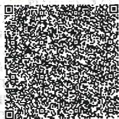
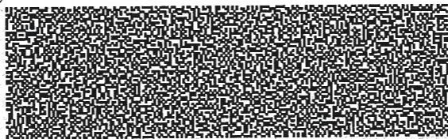
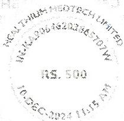
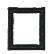

## e-Stamp

## Certificate No.

Certificate Issued Date

Account Reference

Unique Doc. Reference

Purchased by

Description of Document

Property Description

Consideration Price (Rs.)

First Party

Second Party

Stamp Duty Paid By

Stamp Duty Amount(Rs.)

## : IN-KA90646203865707W

: 10-Dec-2024 11:15 AM

: NONACC (FI)/ kacrsfl08/ PEENYA3/ KA-RJ

: SUBIN-KAKACRSFL0820925472387509W

: HEALTHIUM MEDTECH LIMITED

: Article 5(J) Agreement (in any other cases)

: TRANSPORTATION AND DISTRIBUTION SERVICES AGREEMENT

: 0
    (Zero)

: HEALTHIUM MEDTECH LIMITED

: SRI ENTERPRISES

: HEALTHIUM MEDTECH LIMITED

: 500
(Five Hundred only)

seal

PAA CREEF OPERATIVE SOCIETY LTD
PAA CREEF OPERATIVE SOCIETY LTD

text_image

QR code image containing encoded data, no visible human-readable text

text_image

Black and white QR code image containing encoded data

seal

MCKO TINUM MEDTECH LIMITED
MAKAPAN 06420355707
RS. 500
16-56-2024/11/05 AM

Please write or type below this line

This Stamp Paper forms an integral part of
Transportation & Distribution Services Agreement
entitled into between Healthium Medtech Limited
and M/S Sri Enterprises executed on 10.12.2024
("Date of Execution") and made
effective from 01.12.2024.

seal

Healthium Medtech Limited
Bangalore

seal

SRI ENTERPRISES
BANGALORE

# TRANSPORTATION AND DISTRIBUTION SERVICES CONTRACT

This SERVICES AGREEMENT is entered into at Bangalore on 10 $^{th}$ December 2024 (Execution date) and is effective from 1 $^{st}$ December 2024 (“Effective Date”).

## BY AND BETWEEN

M/s. HEALTHIUM MEDTECH LIMITED (CIN No. U03311KA1992PLC013831), a company incorporated under the Companies Act, 1956 and having its registered place of business at 472/D, $4^{\text{th}}$ Phase, $13^{\text{th}}$ Cross, Peenya Industrial Area, Bangalore, Karnataka - 560058, India, duly represented by its Authorized Signatory and Group Chief Financial Officer Mr. Sudeep Dhariwal (hereinafter referred to as the "Customer" or "Healthium", which expression shall, wherever it occurs, mean and include its affiliates, successors in office and assigns), of the FIRST PART.

## AND

M/s SRI ENTERPRISES, a company registered under the provisions of Companies Act, 2013, bearing GST No.29BVLPP8714P1ZH and having its registered office at \_NO.03, G V P COMPLEX, KAMMAGONDANAHALLI, JALAHALLI WEST, Bengaluru (Bangalore) Urban, Karnataka,\_and duly represented by its Authorised representative Mrs. Padma (hereinafter referred to as Service Provider, which expression shall, unless repugnant to the context or meaning thereof shall include its associate companies, affiliates, representatives, successors, and permitted assigns) of the SECOND PART.

CUSTOMER and SERVICE PROVIDER shall jointly be referred to as "Parties" and individually as "Party".

WHEREAS the Customer is engaged in the business of manufacturing, marketing and sale of Surgical and Wound closure products, consumables and minimally invasive products for domestic and international use and is desirous of engaging a Service Provider for pickup, transportation and distribution of its goods within India.

AND WHEREAS the Service Provider inter-alia is engaged in the business of Logistics Services.

AND WHEREAS the Service Provider represents itself as having the requisite expertise, infrastructure and network capability as a logistics service provider as required by the customer.

AND WHEREAS the Customer based on the representations made by the Service Provider, hereby appoints the Service Provider to provide logistics services under this Agreement as detailed hereinafter.

NOW THEREFORE IN CONSIDERATION OF THE PROVISIONS AND MUTUAL CONVENANTS CONTAINED HEREIN, IT IS AGREED BY AND BETWEEN THE PARTIES AS FOLLOWS:

## 1.0 COMMENCEMENT OF AGREEMENT (TERM):

This Agreement is valid for a period of 2 (Two) years, effective from 01.12.2024 to 30.11.2026, and service may be renewed/cancelled further, upon the mutual consent of the Parties.

2.0SCOPE OF CONTRACT: The contract is a contract for carriage of goods by Road.

## 3.0 TRANSIT TIME:

Turn Around Time (TAT) between pickup and delivery points shall be as communicated by the Service Provider. The transit times and assurances are subject to change prior to providing reasonable notice to the customer in writing. The Turn Around Time is more particularly described under Annexure 'I'.

## 4.0 CONSIDERATION:

The Parties hereto agree that the Service provider shall invoice or charge the Customer for the logistics services rendered by it as per the tariff structure and rates described in the Annexure 'II', and the Customer shall make payments accordingly, subject to further clarifications included herein under.

## 4.1 Total Freight Charges:

Total Freight charges include Base Freight and all other components detailed in the Annexure 'II', but excludes cess, duties and any other taxes as may be levied by the Authorities from time to time and payable by the Service Provider with pass through to the Customer.

## 4.2 Invoice Weight:

Weight of the Shipment shall be measured as per the Volumetric Calculation of multiple packing shipper cartoons with the different dimensions-which is captured in the Annexure 'II'.

## 4.3 Fuel Surge Charge:

FSC is mutually agreed by both the parties which is part of the commercials mentioned in the Annexure.

## 4.4 Risk Charges:

The Customer is under obligation to insure its shipments at its own cost. The Service Provider thereby agrees to directly compensate the customer for any loss, theft and/or damage of goods while in transit, to the extent of Rs.15,000/- (Indian Rupees Fifteen Thousand only) or actual invoice value whichever is lower and above which the service provider shall support the customer in providing the necessary documents as a part of COF. Any ROV if agreed mutually by both the parties will be part of the Annexure.

## 4.5 Remote Location-ODA/ESS:

Both the parties mutually agree to the TAT defined in the Annexure for ODA locations. The service provider shall share the list of Serviceable Pin codes and the Pin codes falling under ODA Category along with their TAT. If the service provider fails to deliver at ODA locations as per the TAT, because of service provider's internal issues there shall be a penalty of $10\%$ (Surface) on such dockets which are delivered on 2 working day beyond the agreed TAT for Surface

However, customer understand that there can be unforeseen circumstances beyond control causing delivery delay, which shall be considered with no penalty provided the service provider informs in writing.

## 4.6 Taxes, Duties and Other Charges:

a) The Freight charges quoted in Annexure -II are exclusive of all taxes.

b) The Customer agrees to pay GST, CESS, and any other taxes / levies, etc., as may be applicable on the freight and other applicable charges from time to time. Service Provider is not responsible for any default/irregularity committed by the Customer in paying the same.

c) Service Provider in its sole discretion may initially pay any GST/Cess/taxes/levies as may be levied by the authorities on behalf of the Customer / receiver / consignee and the same shall be reimbursed at the time of delivery of the shipment. Upon refusal / failure to pay the same, the Customer shall be responsible and liable to reimburse the same within seven (7) days from the date of demand by Service Provider. Service Provider shall not extend any credit limit for levies/cess/other such statutory charges.

d) The Customer agrees and undertakes to submit all the relevant documents / papers / E-way Bill Copy / E-way Bill electronic reference number / Goods Forwarding Note and / or other details as stipulated under the GST Code applicable under different laws/rules/procedures from time to time, including but not limited to documentation for tax clearance, along with handover of the shipment at the time of booking. Customer shall be solely held liable in case any shipment is seized or held by any authority due to non-availability of required documents/papers. However, Service Provider agrees to provide duplicate receipts/Transporters invoice in case the originals are misplaced in transit, and further the Customer / receiver undertakes to pay for the same including any other statutory charges on the strength of the above documents without any demur. Service Provider will under no circumstances, be liable for damages or loss or liability caused due to confiscation of the shipment or any part thereof by any government, semi government authority etc.

e) The Customer hereby agrees and undertakes to declare the accurate description and details of each shipment in the relevant E-way Bill without fail. Customer further agrees and confirms that the Service Provider shall not be liable for any dis-allowance or issues or claims that may arise due to inaccurate and / or incorrect details mentioned in the E-Way Bill, and the Customer shall be solely responsible for seizure or detention of any shipment by any authority due to such inaccurate and / or incorrect details mentioned in the E-way Bill or otherwise.

f) The Customer hereby declares that the details provided with respect to GSTN are true and accurate and as such, it agrees and confirms that Service Provider shall not be liable for any disallowance or issues that may arise due to inaccurate and / or incorrect GSTN number mentioned on Service Provider's Invoice / Credit Note / Debit Note, as the case may be. In the event the Service Provider inadvertently mentions an incorrect GSTN on its invoices, the Customer shall forthwith bring such fact to the Notice of the Service Provider and obtain revised invoices.

g) The Customer shall be entitled to deduct tax deducted at source (TDS) on the amounts payable / paid towards logistics services in accordance with the provisions of the Income Tax Act 1961 as applicable. The Customer shall furnish the TDS certificates on a quarterly basis to the Service Provider. The Customer agrees to refund the TDS amount if TDS certificates have not been provided within the time limit prescribed under the Income Tax Act / Rules.

## 5.0 INVOICING & PAYMENT TERMS:

a) In compliance with the provisions of the GST Code, the Parties hereby agree and confirm that Service Provider's booking unit location shall raise invoice on Customer's principal place of business location and accordingly mention the GSTN as provided by the Customer in Annexure-III i.e., State of origin location. In case the Customer confirms to raise the invoice on ISD registered office, then it shall be the responsibility of the Customer to ensure that the input tax credit is appropriately distributed as per the provisions of the GST Act. Non-adherence to the above shall entail the Customer to indemnify the Service Provider against any statutory liability that may arise to the Service Provider due to such default on part of the Customer in distributing the input tax credit correctly as ISD.  
b) Service Provider shall raise and submit the invoice (e-billing) at a regular frequency, as specified in Annexure II, for the services rendered by it against dockets DELIVERED within each period. The Customer agrees to pay all invoices within the maximum allowed credit period, as specified in Annexure II, from the date of invoice/s. All payments shall be made through Digital Modes or through an RTGS/NEFT/IMPS transfer to the designated bank account or A/c Payee cheque/s /D.D's in favor of Details of the designated bank account are as included in the attached Annexure IV.  
c) The Parties hereby agree and confirm that Service Provider shall not be liable for any penalty or liquidated damages or deductions from the freight or otherwise. While the Service Provider undertakes to address all issues to the entire satisfaction.  
d) Further, the Parties hereby agree and confirm that any correction and / or deduction in the Invoice/s shall always be carried out by issuing proper debit note / credit note, as the case may be, without fail. Further, the Customer shall not request for or force issuance of credit notes after the expiry of the credit days in any circumstances.  
e) Any shipment returned/redirected to Origin /some other destination shall be sent on a fresh Docket / Consignment Note / E-Way Bill / Airway bill and the applicable freight charges

shall be payable by the Customer.

f) In the event the Customer fails to pay outstanding dues beyond sixty (60) days from the date of invoice, for whatsoever reasons, the credit facility available to such customer shall stand revoked; further the Customer Code shall automatically stand blocked, without any prior notice by Service Provider, and without prejudice to its other rights to recover its receivables. Thereafter, the resumption of the Customer Code and / or Credit terms as agreed hereinabove, shall be at the sole discretion of Service Provider, and such relaxation shall under no circumstances be construed as waiver of Service Provider's rights under this Agreement or any law.

g) Furthermore, parties agree that non-adherence or deviation from payment terms by the Customer shall result into a breach of Customer's representations and warranties under this agreement. On occurrence of such deviation/non-adherence, Service Provider shall have the right to terminate the agreement by serving a written notice to Customer.

h) The Parties hereby agree and confirm that acknowledgment of submitted invoices and release of payments shall not be linked to provision of MIS report or any additional information / documents by Service Provider to the Customer.

i) The Parties hereby agree that e-POD or scanned copy of the POD duly attested by the consignee, shall be accepted by the Customer as final confirmation of delivery of the docket cargo to the consignee. Service Provider at its sole discretion may provide original POD's on the special request of Customer for exceptional cases, subject to payment of necessary charges as per the Service Provider's tariff, as may be applicable from time to time.

j) The Service Provider is likely to be availing an Invoice Factoring or Bill Discounting facility against the Customer Invoices from reputed banking institutions. In such circumstances, the Customer acknowledges the seriousness of timely payment and commits to prompt payment and clearance of its invoice dues, the same being crucial for the Service Provider to maintain the line of credit with the banking financial institution. In such an arrangement, the Service Provider may specify a separate Bank Account for payments as agreed with the said banking financial institution, and the Customer shall comply with any such directions.

## 6.0 BASIS & INSPECTION:

It is expressly understood and agreed by and between the Parties that all shipments entrusted by Customer and booked by Service Provider shall be on “SAID TO CONTAIN BASIS” i.e. Service Provider shall be under no obligation to verify the description and physical contents of the shipment declared by the Customer on the Docket/ Consignment Note / E-Way Bill / Airway bill; and as such, the Customer shall undertake and ensure to make correct and factual declaration on the Docket/Consignment Note / E-Way Bill / Airway bill. However, Service Provider reserves the right to inspect shipments and / or refuse booking of shipments not conforming to these terms and conditions, without assigning any reasons whatsoever. In case of imported shipment, the Customer must inform the booking office of the Service Provider to get a pre inspection survey done before the pickup is done.

## 7.0 CLAIMS:

(a) The Customer hereby agrees not to deduct/adjust/set off any claim, from the outstanding amount payable towards freight to Service Provider, and further hereby agrees to follow the process herein below as specified by the Service Provider for settlement of claims.

(b) No claim shall be entertained by Service Provider for any loss, shortage, damage, non-delivery, breakage, leakage, pilferage, etc., for the shipments/dockets unless a written claim is lodged within three (3) days from the date of delivery or within twenty-one (21) days from the date of booking, whichever is earlier. Any claim is subject to continued payment of HRR/ROV at the time of booking and remarks on the Proof of Delivery (POD). Remarks / endorsements on Invoice are not eligible for claim process.

(c) The Parties hereby agree and confirm that the obligation of Service Provider to settle the claim as mentioned in clause 4.4 above shall arise subject to Customer furnishing all relevant documents as specified in the Service Provider's Claim SOP, and the Service Provider assures claim processing within fifteen (15) days from the date of the customer's claim intimation with completed documentation.

(d) For Customer's on Owner's Risk, in case of validated loss and/or damages in Docket shipments wherein the corresponding Customer Invoice Value exceeds INR 15,000/- (Indian Rupees Fifteen Thousand only), the Service Provider shall extend all support to the Customer by way of issuing the Certificate of Facts or Observation Note (OBN) within fifteen (15) days so that the Customer is able to lodge and process its insurance claim through its own third party insurance arrangement. In case of validated loss and/or damages in Docket shipments wherein the corresponding Customer Invoice Value is under INR 15,000/- (Indian Rupees Fifteen Thousand only), the Service Provider shall compensate the customer through issuance of a Credit Note.

## 8.0 TIME GUARANTEED PRODUCTS

If Service Provider fails to deliver time guaranteed products (that Transporter may offer and that Company ordered) within the time specified and if the Transporter's failure was not caused by any events set out in the agreement and if the Company notifies the Transporter of their claim in compliance with clause 7, Transporter will charge the Company for the actual delivery service provided rather than charging the price, the Transporter quoted for the service the Company had asked for within the same product category as the service Company ordered.

## 9.0 LIMITED LIABILITY:

a) The Shipments carried by the Service Provider will be subjected to several constraints from the external agencies, which are beyond the reasonable control of the Service Provider. Service Provider shall not, under any circumstances, be liable for any consequential, incidental, or special damages, direct or indirect loss, claims, expenses, or delay in pick up, transportation or delivery of any shipment, regardless of the causes of such delays, of whatsoever nature and howsoever arising.

b) Service Provider shall not be liable in any manner, whatsoever, to the

Customer/consignee or any third party, if the consignee/receiver has accepted the shipment, without any demur, by signing the Proof of Delivery (POD). The responsibility of Service Provider ceases immediately once the shipment(s) is/are delivered.

No liability is assumed for any errors / omissions of any information / data that is imparted by the Customer in respect of the shipment/s traveling under the Docket/ Consignment Note / E-Way Bill / Airway bill.

## 10.0 OBLIGATIONS OF THE CUSTOMER:

The Customer shall not book, hand over or allow to be handed over any shipment consisting of prohibited, restricted, hazardous, or dangerous goods.

Customer shall not book / hand over any hazardous or dangerous shipment as specified in the "IATA DGR Shipment Regulations Handbook Book", ICAO (International Civil Aviation Organization) or any governmental, semi-Governmental, executive, legislative or judicial authority/department, instrumentality, commission, board or statutory corporation of or any corporation or other entity (including a trust), owned or controlled directly or indirectly by, any of the foregoing or any similar body including without limitation, any stock exchange or any self-regulatory organization established under any law or regulation, from time to time.

Further the Customer agrees and undertakes to not book / hand over any shipment which is not permitted and / or is restricted by any law / rule from time to time.

Also, the Customer agrees and undertakes not to book/hand over any shipment or any items notified by Service Provider to be restricted and/or banned and/or dangerous and/or prohibited from time to time, including but not limited to dangerous or hazardous goods or animals, bullion, currency, bearer form negotiable instruments, precious metals and stones, firearms or ammunition or parts thereof, human remains, pornography and drugs or narcotic substances, etc.

The Customer hereby agrees to declare and confirm the weight of the shipments as mentioned in the Dockets at the time of booking only. However, Customers who have direct bookings at multiple consignor locations linked to, shall get the weight details of shipments as specified in the Dockets/Airway bill from their own authorized employee at respective location/s or shall rely upon the daily booking file sent by Service Provider on daily T+1 basis, and any variance in weight shall be notified to Service Provider on the same T+1 day, before the cut off time. The Customer shall not deduct / adjust / set off any amount from the invoices, payable to Service Provider on account of Weight Variance.

The Customer shall ensure that the packaging of the shipment is adequate to carry the shipment, carriage worthy, so as to withstand the normal rigors, jerks and jolts of transportation hazards. Service Provider reserves its right to reject any shipment if the packing is not transit worthy.

The Customer certifies that all statements, details, and information relating to shipments provided by it under this Agreement are true and correct. Service Provider shall not be responsible or liable for the improper documentation provided and incorrect information furnished by Customer.

If the Customer/ Consignee refuses to accept the delivery or to pay on delivery wherever applicable, or the shipment is deemed to be unacceptable or if the Customer/ Consignee cannot be reasonably identified or located, Service Provider will rebook the same to the origin or to any other address specified by the consignor as specified under Clause 5(e) above.

The Customer shall be liable and solely responsible for any manufacturing defects / disposal of damaged / defective and expired goods and will ensure timely disposal of such products as per statutory guidelines.

The Customer hereby undertakes and represents that it is in compliance with all applicable laws including but not limited to circulars, guidelines, etc., and warrants Service Provider that it shall comply with all applicable laws, circulars, guidelines, etc., as may be notified from time to time and it shall solely be responsible for any violation of any statute or regulation or circular or guideline, etc., as may be issued by any authority either for movement or otherwise.

The Customer hereby agrees and undertakes that any employee, agent, representative, contractor employed directly by Service Provider or through any contractor working for Service Provider or any of its group companies should not be hired by the Customer or its group companies within twelve (12) months of his/her date of cessation of any relation with Service Provider or any of its group / associate companies.

The Customer hereby agree and undertakes that it will at all times conduct its business and otherwise comply and ensure that every representative, employee, officer, Delivery Personnel and director will in relation to the conduct of its business (i) in all respects comply with Service Provider's code of conduct; and (ii) does not undertake or cause to undertake any corrupt act or agree to assist any person to retain the benefits of or profits from a crime or any corrupt act.

The Customer or any of its representative in relation to the Customer affairs, will ensure that neither the Customer nor any of its representative acting for or on its behalf, directly or indirectly:

(i) makes or authorizes the making of any contribution, gift, bribe, influence payment, kickback, or any other fraudulent payment in any form, whether in money, property, or services, or anything of value to any public official or otherwise:  
(ii) To obtain favourable treatment in securing or retaining the business of Service Provider or directing any business to or by Service Provider; or  
(iii) To pay for favourable treatment for business secured by the Customer or to obtain special concessions or for special concessions already obtained, in each case which would have been in violation of any applicable law.  
(iv) Commit any act which will violate any applicable anti-corruption laws.

Any instances of violation of this Clause will be viewed in a serious manner and Service Provider reserves the right to take all appropriate actions or remedies as may be required under such circumstances.

## 11.0 INDEMNITY:

Either party shall keep each other indemnified:

a) Against freight and other charges including but not limited to the GST, other taxes and levies levied on the shipment in the event of non-payment of the freight and all other charges, payable by the Customer / receiver / consignee.

b) Against all claims, losses, charges and expenses incurred by Service Provider due to any banned, restricted, dangerous or hazardous items entering into its network due to any omission or commission of the Customer.

c) In the event that the Customer does any act, deed or thing or fails to do the same, which results in any loss, damage, harm or injury to Service Provider, the Customer agrees to indemnify and hold Service Provider safe and harmless from and against all costs, losses, claims, actions or damage suffered or incurred including any legal costs.

d) The Service Provider shall be liable hereunder only for its own gross negligence, wilful misconduct or bad faith. The Service Provider agrees to indemnify the Company and save it harmless against any and all liabilities, including judgments, costs and reasonable counsel fees, for anything done or omitted by the Service Provider in the execution of this Agreement, except as a result of Company's gross negligence, wilful misconduct or bad faith.

e) Service Provider does not carry any perishable shipment. However, in case of perishable shipment, Service Provider shall have the right to dispose of or sell the shipment immediately and without notice and as such, the Customer shall keep Service Provider indemnified against all claims, charges and expenses incurred by Service Provider due to such perishable shipment entering into the network of Service Provider.

## 12.0 ANTI-BRIBERY:

The Service Provider will comply with all the applicable anti-bribery and corruption laws, including without limitation, the U.S. Foreign Corrupt Practices Act, UK Bribery Act, 2010, and Prevention of Corruption Act India, 1988 and other similar applicable legislation in the jurisdictions where it operates. Neither Service Provider nor any of its employees, directors, officers, or agents shall offer, promise, provide, or authorize the provision of any money, property or other thing of value, directly or indirectly, to any person, entity or foreign official to influence official action or to secure an improper advantage.

The Service Provider nor any of its employees, officers, directors, agents or affiliates (a) has been convicted of, pleaded guilty to, or been charged with any offense involving fraud, corruption, or any violation of any anti-bribery and corruption law, sanctions, or export control laws; (b) is or has been a Sanctioned Party at any time in the last five years; or (c) is party to any actual or threatened legal proceedings or outstanding enforcement action relating to any breach or suspected breach of any applicable anti-bribery and corruption laws, sanctions, or export control laws.

## 13.0 FALSIFICATION

This refers to any regulatory documents submitted by the Company with the Service Provider for meeting any objectives pertaining to this Agreement. The Service Provider represents and assures that any such regulatory documents submitted by the Company with the Service Provider for any business purpose will not be tampered / falsified under any circumstances. In the event of such an incident, the business arrangement between the Parties shall stand terminated immediately and the Company shall take the suitable recourse in law for which the Service Provider alone shall be responsible for the consequences thereof. The above stands applicable for all the Employees, Agents, and Associates, etc. engaged by the Service Provider with regard to the above business purpose.

## 14.0 GENERAL LIEN:

a) Service Provider shall have the right to exercise a General Lien over all the shipments of the Customer for non-payment of any dues including levies imposed by any authorities. However, on the request of Customer, the Service Provider may store the shipments for limited period, as may be mutually agreed between the Parties, at the sole risk of Customer, subject to payment of demurrage / warehousing charges by the Customer.

b) In case, the Customer / receiver fails to pay the dues within the stipulated time as mentioned elsewhere in this Agreement, Service Provider further reserves its right to sell the shipment by public auction, tender, private agreement or otherwise or even destroy the shipment as required under any laws applicable from time to time, without prejudice to its other legal remedies to recover its dues.

c) The Customer agrees that Service Provider shall not be liable to the Customer or any other person for any loss or damage caused to the shipment or any part thereof, or any diminution in the value of the shipment or any part thereof, by Service Provider in exercising its right of lien hereof.

## 15.0 APPLICABILITY:

The Customer / shipper / beneficiary hereby agrees, confirms, and acknowledge that they are fully aware of the terms and conditions applicable to all shipments that are entrusted to Service Provider, and that all or any such transaction of the shipment shall always be subject to the special terms and conditions hereof, in addition to the terms and conditions as may be updated from time to time.

## 16.0 AMENDMENTS:

Any amendments to the terms and conditions hereof shall be mutually agreed and reduced the same into writing, duly signed by the authorized signatories of both Parties and the same shall be effective after seven (7) days from the date of signing of such amendments.

## 17.0 TERMINATION:

Either Party may terminate this Agreement for convenience by giving one (1) month prior written notice to the other Party. The notice must be sent to the above specified address by registered post with Acknowledgment Due / Speed Post only, addressed to the authorized person. However, it is made abundantly clear that the Customer shall forthwith settle all dues pending as on date of termination along with the interest thereon, payable to Service Provider, on receipt of written notice of termination by Service Provider.

## 18.0 SEVERABILITY:

If any one or more provisions of this Agreement shall be invalid, illegal or unenforceable in any respect, the validity, legality and enforceability of the remaining provisions contained herein shall not in any way be affected or impaired thereby.

## 19.0 FORCE MAJEURE:

If the whole or any part of the performance of their respective obligations under this agreement by the parties is prevented or delayed by causes, circumstances or events beyond the control of the parties, including delays due to flood, fire, earthquakes, riots, explosions, wars, hostilities, acts of the government, or other causes of a nature beyond the control of the parties, then to the extent the parties shall be so prevented or delayed from performing all or any part of its obligations hereunder, by reason thereof, despite due diligence and reasonable efforts to do so, then notwithstanding such cases, circumstances or events, the parties shall be excused from performance hereunder for so long as such causes, circumstances or events shall continue to prevent or delay such performance.

## 20.0 CONFIDENTIALITY:

"Confidential Information" means all oral, written or electronic information or data, and any accompanying support material and documentation, disclosed directly or indirectly by the Service Provider to the Customer. Subject to the terms and conditions of this Agreement, Customer hereby agrees that during the term of this Agreement and for a period of one (1) year thereafter: (i) Customer shall not publicly divulge, disseminate, publish or otherwise disclose any Confidential Information pertaining to the Service Provider without the Service Provider's prior written consent, which consent shall not be unreasonably withheld; and (ii) Customer shall not use any such Confidential Information for any other purposes other than purpose agreed herein between the Parties.

## 21.0 GOVERNING LAW AND JURISDICTION:

This Agreement shall be construed in accordance with the laws of India. Any proceeding arising from or under any award / interim order by the Arbitrator under Clause No.22.0, herein below, shall be subject to the exclusive jurisdiction of Courts at Bangalore in the state of Karnataka, India.

## 22.0 ARBITRATION:

In case any dispute or difference arises between the parties during the term of this Agreement or after its termination or earlier termination, as to its meaning and construction or to any other matter, or things arising directly or indirectly under this Agreement, in such an event the same shall be referred to a sole Arbitrator to be appointed by the Service Provider, by fast track procedure governed under the provisions of Arbitration & Conciliation Act, 1996 and Arbitration & Conciliation (Amendment) Act, 2015 or any other statutory amendment/s thereof. The Seat/ venue of such arbitration shall be at Bangalore in the state of Karnataka, India and shall be conducted in English Language. The award of the Arbitrator shall be final and binding on the parties. The cost of arbitral proceedings and enforcement of award / interim relief shall be borne by the Customer.

We, confirm our acceptance to the Special Contract Terms & Conditions as contained in this Agreement. In confirmation of having accepted the same we, put our seal and signature hereunder:

IN WITNESS WHEREOF the Parties hereto have caused the execution of this Agreement on the date hereinabove written

Signed, sealed and delivered for and on behalf of:

<table><tr><td colspan="2">HEALTHIUM MEDTECH LIMITED</td><td colspan="2">SRI ENTERPRISES</td></tr><tr><td>Signature: </td><td></td><td></td><td></td></tr><tr><td colspan="2">Name of the Authorized Person: Mr. Sudeep Dhariwal</td><td colspan="2">Name of the Authorized Person: Mrs. Padma</td></tr><tr><td colspan="2">Designation: Group CFO &amp; SCM Head</td><td colspan="2">Designation: Proprietor</td></tr></table>

# Annexure-I – Turn Around Time (TAT) Matrix

a) The TATs indicated herein above are exclusive of the date of Booking, and for this purpose, the deemed cut-off time for the day's booking shall be taken as 1800 hours. Shipments booked beyond this agreed cut-off time shall attract one additional day of transit time.  
b) Service Provider's domestic geographic footprint as on date of signing of this document is demarcated as four zones, namely, North, Central, West and South, and it currently excludes East, J&KL and Kerala which shall form part of a later expansion.  
c) Within Zone TAT for Origin-Destination pairs under 500 KM distance shall be one (1) day, while for Origin-Destination pairs exceeding 500 KM distance, the same shall be two (2) days.  
d) Inter-Zone TAT for Origin-Destination pairs is approximately matched to $[1 + (1/2) *$ State Borders Crossed] rounded up to the nearest integer, wherein the Count of State Borders crossed is numbers of state borders encountered by an imaginary line joining the capital cities of the origin-destination states. For Distances exceeding 2200 KM, an additional one (1) day is added to the TAT.  
e) Notwithstanding the TATs indicated in the matrix above, a grace period of additional 1 day shall be assumed for deliveries in Tier 2 & Tier 3 Towns.  
f) Customer's certain Consignees who are Remotely Located at Outside Delivery Areas shall be served with additional 2 days of TAT.  
g) Estimated Delivery Date (EDD) for each Docket is automatically computed as [Booking Date + TAT in Days]. If the EDD falls on a Sunday or other notified Holidays, the EDD stands automatically reset to the next working day.  
h) TAT matrix indicated herein above is as on date of signing of this Service Agreement. The same is subject to further monthly changes at the sole discretion of the Service Provider, with any changes being intimated monthly to the Customer.

seal

Healthium Medtech Limited
Bangalore

seal

SRIENTERPRISES
BANGALORE

## Annexure-II – Commercial Terms and Conditions

1: Base Freight Matrix :

<table><tr><td colspan="8">SURFACE (Road) Rate Card</td></tr><tr><td>From /To</td><td>North</td><td>Central</td><td>West</td><td>South</td><td>J&amp;K</td><td>East</td><td>N-East</td></tr><tr><td>Bangalore</td><td>16</td><td>16</td><td>14</td><td>8</td><td>18</td><td>18</td><td>21</td></tr></table>

## 2: Charge Weight Customer Method Choice: Charged Weight Factor CWF Method (or) Volumetric CFT Method

Volumetric CFT method:

In Surface - Charge Weight = [(LBH/1728\*6) inches] (or) [Actual Weight], whichever is higher

3: Other commercials for Domestic:

<table><tr><td>I. Minimum Chargeable Weight: 40kg in Surface or Rs. 500 whichever is higher</td></tr><tr><td>II. Docket Charges: Rs 100</td></tr><tr><td>III. Freight on Value (FOV) Charge:0.2% or Rs-100 whichever is Higher in Surface</td></tr><tr><td>IV. Fuel Surcharge - will be 15% on Basic Freight Value in Surface Mode</td></tr><tr><td>V. Minimum Liability Rs.15,000/- Above will be COF Accepted</td></tr><tr><td>VI. ODA Charges will be Rs. 1500 In Surface above 50kms</td></tr><tr><td>VII. Reverse Pickup Charges-Same as Forwarding charges</td></tr><tr><td>VIII. Handling Charges Handling Charge-Loading and Unloading charges are not payable Extra, only acceptable at Union Unloading Locations with Actual Slips.</td></tr><tr><td>IX. Floor Charges Delivery at doorstep till 1st floor is free. From 2nd Floor Rs 200/- will be charged for each floor</td></tr><tr><td>X.RTO charge-Equivalent to Forward charges as above</td></tr></table>

## 4: Penalty Clause:

√ Delay Beyond 2 days in surface -25% on basic Freight will be deducted against the docket.

## General Terms and Conditions:

- GST as applicable on all the above charges & rates  
• Dedicated Key Accounts Executive will be assigned to your Account.

• Timely MIS on daily basis.  
• E-POD will be provided 100% before submission of bill.  
- In case of any shortage/damage during transit, we will arrange the COF through our service partner only if damage /shortage mentioned on POD.  
- Return Shipments (RTO) shall be charged same as Forward Rates.  
• Demurrage Charges: NIL.  
- Any Mathadi Charges for Maharashtra Locations/Union Charges for Kerala Locations will be charged as per actuals.  
- Unloading will be done till 1 $^{st}$ floor of the customer, over above will be charged as per the actuals with mutual discussion on case-to-case basis.  
- CREDIT PERIOD: 30 Days from the month end billing for the month in which pickup is made.  
- Payments to the Company by the Customer are to be made vide account payee.

3: Invoicing & Credit:

<table><tr><td>#</td><td>Details</td><td>Terms</td><td>Confirmation</td></tr><tr><td>A</td><td>Invoicing Basis (Booked Dockets)</td><td>Booked Dockets</td><td></td></tr><tr><td>B</td><td>Invoicing Frequency</td><td>Fortnightly</td><td></td></tr><tr><td>C</td><td>Credit Period</td><td>30 Days</td><td></td></tr></table>

FOR CUSTOMER:

<table><tr><td>Company Name (First Party/Customer):</td><td colspan="2">HEALTHIUM MEDTECH LIMITED</td></tr><tr><td rowspan="2">Name of the Authorized Person:</td><td>Tel</td><td>Mobile:</td></tr><tr><td>Email ID:</td><td></td></tr><tr><td>Designation: Group CFO &amp; SCM Head</td><td>Signature</td><td></td></tr><tr><td></td><td>Company Seal</td><td></td></tr></table>

## FOR SERVICE PROVIDER:

<table><tr><td>Company Name (Second Party/Customer):</td><td colspan="2">SRI ENTERPRISES</td></tr><tr><td rowspan="2">Name of the Authorized Person: PADMA</td><td>Tel</td><td>Mobile:</td></tr><tr><td colspan="2">Email ID: sri.service07@gmail.com</td></tr><tr><td>Designation: Proprietor</td><td>Signature</td><td></td></tr><tr><td>Address: NO.03,GVP COMPLEX,
KAMMAGONDANAHALLI,JALAHALLI WEST,
Bengaluru (Bangalore) Urban, Karnataka,</td><td>Company Sea</td><td></td></tr></table>

Annexure-III – GST Details:

<table><tr><td>GST Number</td><td>Billing Address</td><td>Billing City</td><td>Billing State</td><td>Billing Pincode</td></tr><tr><td>29BVLPP8714P1ZH</td><td>NO.03, G V P COMPLEX, KAMMAGONDANAHALLI, JALAHALLI WEST, Bengaluru (Bangalore) Urban, Karnataka,</td><td>Bangalore</td><td>Karnataka</td><td>560015</td></tr></table>

Annexure-IV– Bank Details:

<table><tr><td>Account details</td></tr><tr><td>Account holder name - SRI ENTERPRISES</td></tr><tr><td>Name of the Bank - CANARA BANK</td></tr><tr><td>Current Account Number - 0690201002555</td></tr><tr><td>Branch address - GOKULA BRANCH</td></tr><tr><td>IFSC Code - CNRB0000690</td></tr></table>